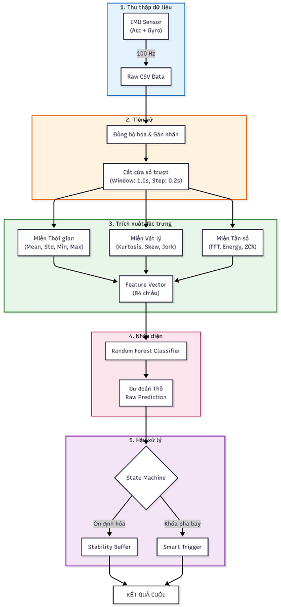
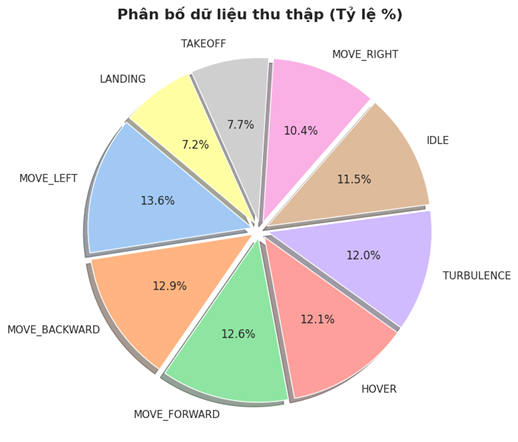
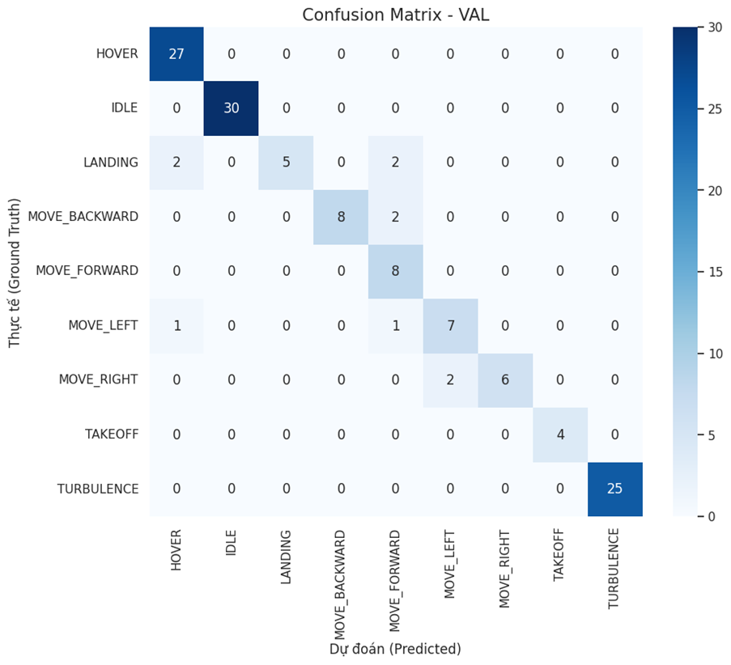
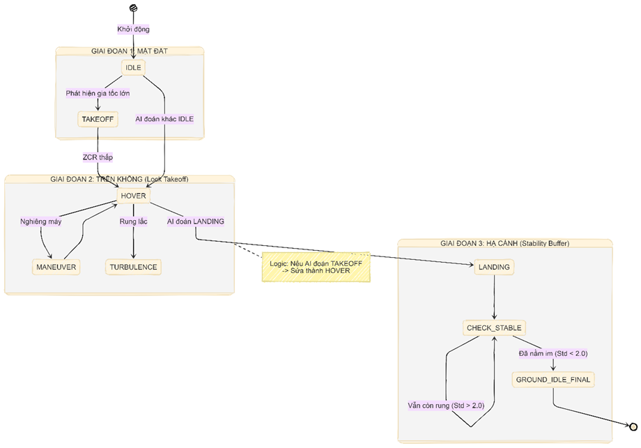

# 🚁 Intelligent Drone Flight Maneuver Recognition (ML Project)

> A university ML project in the **ML Engineer / Embedded AI** direction: building an end-to-end pipeline to recognize drone flight states from IMU data (Accelerometer + Gyroscope), from raw preprocessing to blind-test inference.

## 🔗 Quick Links

- Report PDF: [REPORT_Drone_Project.pdf](https://drive.google.com/file/d/1_yZA7aBtUC88873U7m2eNC3-CviHxv_0/view?usp=sharing)
- Slide: [SLIDE_drone.pdf](https://drive.google.com/file/d/189CO6kjS5v1c_zXcYDXF13cou4UaUIb5/view?usp=sharing)

## 1) Project Objectives

- Recognize drone flight states from 6-axis IMU data sampled at 100Hz.
- Build a complete ML workflow: ETL → EDA → Sliding Window → Feature Engineering → Training → Inference.
- Compare **Full** (84 features) vs **Lite** (30 features) models to balance accuracy and speed.
- Present results in a practical, recruiter-friendly portfolio format.

## 2) Classification Problem

Main target classes:

- `HOVER`
- `IDLE`
- `LANDING`
- `MOVE_BACKWARD`
- `MOVE_FORWARD`
- `MOVE_LEFT`
- `MOVE_RIGHT`
- `TAKEOFF`
- `TURBULENCE`

## 3) Key Results

From `09_Final_Blind_Test.ipynb`:

- **Train samples:** 1750
- **Validation samples:** 130
- **Test samples:** 96
- **Model Full:** Random Forest (`n_estimators=200`, `max_depth=None`, `criterion=gini`)
- **Input features (Full):** 84
- **Test accuracy (Raw AI - No Logic):** **0.8750**
- **Weighted F1 (Test):** **0.8796**
- **Macro F1 (Test):** **0.7117**
- **Average inference time:** ~**54.65 ms/sample** (~**18 FPS** theoretical)

From `REPORT_Drone_Project.pdf` (with **State Machine logic integrated**):

- **Lite Model + Logic (30 features):** **87.50%** accuracy
- **Full Model + Logic (84 features):** **89.60%** accuracy
- **Validation accuracy (Full model):** **92.31%**

Top feature importances (from logs):

1. `acc_z_min`
2. `acc_y_max`
3. `acc_z_jerk_max`
4. `acc_z_max`
5. `gyro_y_jerk_mean`

## 4) Report & Visual Highlights

| System Architecture                             | Data Distribution                                    |
| ----------------------------------------------- | ---------------------------------------------------- |
|  |  |
| _End-to-end pipeline from data to prediction._  | _Class ratio in the training set._                   |

| Confusion Matrix                                            | Smart Trigger                                         |
| ----------------------------------------------------------- | ----------------------------------------------------- |
|  |       |
| _Most confusion happens among similar maneuvers._           | _Logic reduces false alerts during in-flight phases._ |

> These 4 visuals are selected from the report to quickly show architecture, data characteristics, and post-processing effectiveness.

## 5) Skills Demonstrated (CV-Friendly)

- **Sensor-data engineering:** unzip, timestamp synchronization, and valid-segment filtering.
- **Time-series preprocessing:** 1.0s sliding windows with 0.2s step to improve rare-class sample coverage.
- **Feature engineering:** time-domain, frequency-domain, jerk, and shape-based features.
- **Class imbalance handling:** `class_weight='balanced'` in Random Forest.
- **Model optimization:** reduced from 84 to 30 features for the Lite model.
- **Model evaluation:** classification report, confusion matrix, and error analysis.
- **Practical inference pipeline:** dedicated raw-test processing and blind-test evaluation.

## 6) Personal Data Collection (Built by Me)

- I personally designed the data-collection protocol, recorded the sensor sessions, and curated the dataset used in this project.
- Data was captured from smartphone IMU sensors (Accelerometer + Gyroscope) at **100Hz** and exported as raw logs.
- I organized collection into three scenarios to improve generalization:
  - **Training set (isolated actions):** repeated single maneuvers to learn clean class signatures.
  - **Validation set (sequential script):** continuous flight flow (Idle → Takeoff → Hover → Maneuver → Landing).
  - **Blind test (free flight):** unseen sessions with harder turbulence/noise conditions.
- I also handled labeling, timestamp synchronization, segment trimming, and final train/val/test packaging.

## 7) Notebook Pipeline

The full workflow is organized into 9 notebooks:

1. `01_Data_ETL_Preprocessing.ipynb`  
   Parse raw ZIP files, synchronize sensors, and clean data segments.
2. `02_Data_EDA_Quality_Check.ipynb`  
   Data quality checks, class distribution, and maneuver patterns.
3. `03_Sliding_Window_Generation.ipynb`  
   Sliding window generation (100 samples/window, 20-sample step).
4. `04_Feature_Engineering.ipynb`  
   Feature extraction from each window.
5. `05_Model_Training_Full.ipynb`  
   Train and evaluate the full Random Forest model.
6. `06_Logic_State_Machine_Dev.ipynb`  
   Develop post-processing logic / finite state machine.
7. `07_Feature_Optimization_Lite.ipynb`  
   Select key features and train the Lite model.
8. `08_Process_Test_Set.ipynb`  
   Preprocess raw test set using training-consistent settings.
9. `09_Final_Blind_Test.ipynb`  
   Final blind test and reporting metrics extraction.

## 8) Project Structure

```text
data/
  raw/                 # Raw zip data (train/val/test)
  interim/             # Cleaned intermediate data
  processed/           # Windowed data (.pkl)
  features/            # Feature matrices X/y for train/val/test

models/
  rf_model.joblib      # Full model (84 features)
  rf_model_lite.joblib # Lite model (30 features)
  selected_features.json

notebooks/
  01_...09_...ipynb    # Complete experimentation pipeline
```

## 9) Tech Stack

- Python
- NumPy, Pandas
- SciPy
- scikit-learn
- Matplotlib, Seaborn
- joblib
- Jupyter/Colab

## 10) How to Reproduce

### A. Run in order (recommended)

Open and run notebooks in this order:

`01 -> 02 -> 03 -> 04 -> 05 -> 06 -> 07 -> 08 -> 09`

## 11) CV / LinkedIn Bullet Ideas

- Built an end-to-end ML pipeline for drone flight-state recognition from 100Hz IMU signals.
- Personally designed and executed the full IMU data collection protocol (train/validation/blind-test) and dataset curation.
- Designed an 84-dimensional time + frequency feature set, then optimized to 30 features for lightweight inference.
- Trained a multi-class Random Forest and achieved ~87.5% blind-test accuracy.
- Implemented model evaluation with confusion matrix, error analysis, and inference-speed reporting.

## 12) Current Limitations & Future Improvements

- Class imbalance still exists for rare classes (`TAKEOFF`, `LANDING`).
- No deep benchmark yet on real edge hardware (power/latency profiling).
- Possible extensions:
  - Better temporal smoothing (HMM / time-based majority voting).
  - Collect more samples for rare classes.
  - Compare sequence models (`1D-CNN`, `LSTM`, `TCN`) for time-series classification.

## 13) Data Availability Note

This repository **keeps all data and artifacts** (raw/interim/processed/features/models) so the full pipeline can be reproduced without missing files.

---

If you are a recruiter/hiring manager: open `notebooks/` and run them in order to review the complete workflow, from sensor-data processing to feature engineering, training, and model evaluation.
